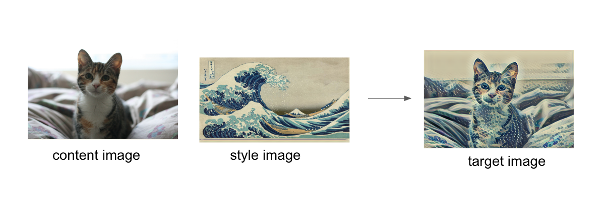
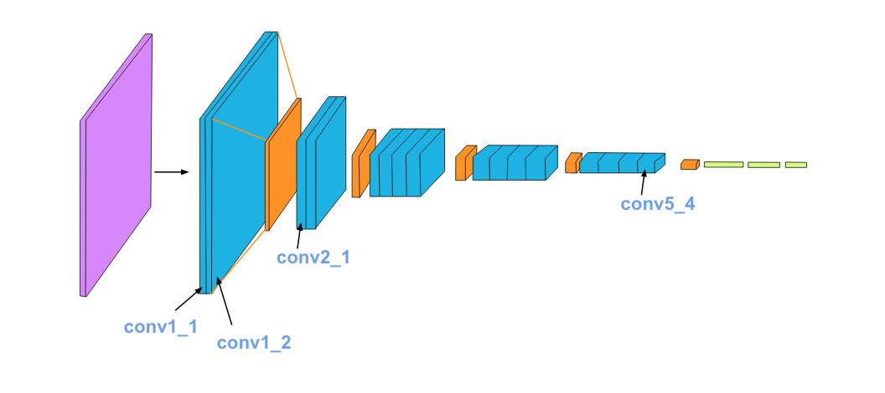

# Artistic-Style-Transfer
This example projects demonstrate the use of Style Transfer in python, iOS, Android mobile applications. 

## Artistic-Style-Transfer
Artistic style transfer takes two input images: one representing "content" and one representing "style"
, such as an artwork by a famous painter or a texture photo to resemble and blend them together 
so the output image looks like the content image, but "painted" in the style of the style reference image.

### Structure 
Main folder contains two notebooks. Both uses VGG-19 pre-trained model from GPU/PyTorch and GPU/Tensorflow. VGG-19 network architecture looks as follows: 

* [PyTorch VGG-19 pretrained model based style transfer](Style_Transfer_PyTorch.ipynb)
* [Tensorflow VGG-19 pretrained model based style transfer](Style_Transfer_Tensorflow.ipynb)
<!-- TODO --> 
These mobile platform requires lite-weight cpu-intensive model so that a pre-trained TensorFlow Lite model and its API are used. 
* [Android style Transfer](/android/README.md)
* [iOS Style Transfer](/ios/README.md)

### reference 
* [Artistic-Style-Transfer](https://arxiv.org/abs/1508.06576)
* [Tensorflow Artistic-Style-Transfer](https://www.tensorflow.org/lite/models/style_transfer/overview)
* [Pytorch-Inception v3](https://pytorch.org/hub/pytorch_vision_inception_v3/)
* [Pytorch transfer learning](https://pytorch.org/tutorials/beginner/transfer_learning_tutorial.html)
